# BEEP Database Schema

## 개요
BEEP 앱의 데이터베이스는 제2정규화를 적용한 관계형 데이터베이스로, 기프티콘/WiFi/멤버십을 통합 관리합니다.

## 주요 특징
- **제2정규화 적용**: 공통 속성은 메인 테이블에, 타입별 속성은 상세 테이블에 분리
- **타입 통합**: 기프티콘, WiFi, 멤버십을 하나의 아이템으로 통합 관리
- **그룹 공유**: 사용자 그룹 간 아이템 공유 지원
- **Firebase 동기화**: 클라우드 동기화를 위한 필드 포함

## Database Schema Diagram

```mermaid
erDiagram
    %% 메인 테이블
    items_table {
        bigint id PK "Auto increment"
        varchar firebase_id "Firebase 동기화용 ID"
        varchar type "GIFTICON, WIFI, MEMBERSHIP"
        varchar owner_id "소유자 ID"
        varchar code "바코드/QR코드 데이터"
        varchar code_type "QR_CODE, CODE_128 등"
        varchar name "아이템 이름"
        datetime created_at "생성일"
        datetime updated_at "수정일"
        varchar sync_status "SYNCED, PENDING, CONFLICT"
    }

    %% 사용자 테이블
    users_table {
        varchar id PK "Firebase User ID"
        varchar display_name "표시 이름"
        varchar profile_image_url "프로필 이미지 URL"
        datetime last_updated "최종 업데이트"
    }

    %% 기프티콘 상세 테이블
    gifticon_details_table {
        bigint item_id PK,FK "items_table.id"
        varchar brand "브랜드명"
        varchar display_brand "표시용 브랜드명"
        datetime expire_at "만료일"
        boolean is_cash_card "현금권 여부"
        int total_cash "총 금액"
        int remain_cash "잔액"
        boolean is_used "사용 여부"
        datetime used_at "사용일"
        varchar memo "메모"
    }

    %% WiFi 상세 테이블
    wifi_details_table {
        bigint item_id PK,FK "items_table.id"
        varchar ssid "네트워크 이름"
        varchar password_encrypted "암호화된 비밀번호"
        varchar security_type "WPA, WPA2, WEP"
        varchar location_name "위치 이름"
    }

    %% 멤버십 상세 테이블
    membership_details_table {
        bigint item_id PK,FK "items_table.id"
        varchar brand "브랜드명"
        varchar membership_number "멤버십 번호"
    }

    %% 이미지 테이블
    item_images_table {
        bigint id PK "Auto increment"
        bigint item_id FK "items_table.id"
        varchar image_type "ORIGINAL, CROPPED, THUMBNAIL"
        varchar local_uri "로컬 URI"
        varchar firebase_url "Firebase Storage URL"
        varchar cropped_rect "크롭 영역 정보"
        datetime created_at "생성일"
    }

    %% 그룹 테이블
    groups_table {
        varchar id PK "Firebase group ID"
        varchar name "그룹 이름"
        varchar description "그룹 설명"
        varchar invite_code "초대 코드"
        varchar created_by "생성자 ID"
        int member_count "멤버 수"
        datetime joined_at "가입일"
        datetime last_sync_at "최종 동기화"
    }

    %% 그룹-아이템 연결 테이블 (다대다)
    group_items_table {
        varchar group_id PK,FK "groups_table.id"
        bigint item_id PK,FK "items_table.id"
        datetime shared_at "공유일"
        varchar shared_by "공유한 사용자 ID"
    }

    %% 사용 기록 테이블
    usage_history_table {
        bigint id PK "Auto increment"
        varchar firebase_id "Firebase 동기화용 ID"
        bigint item_id FK "items_table.id"
        varchar item_type "GIFTICON, WIFI, MEMBERSHIP"
        varchar used_by "사용자 ID"
        int amount "사용 금액 (기프티콘만)"
        varchar group_id "그룹 ID"
        datetime used_at "사용일"
        varchar note "메모"
    }

    %% 동기화 추적 테이블
    pending_changes_table {
        bigint id PK "Auto increment"
        bigint item_id FK "items_table.id"
        varchar change_type "CREATED, MODIFIED, DELETED"
        datetime timestamp "변경 시각"
    }

    %% 관계 정의
    items_table ||--|| gifticon_details_table : "1:1 (type=GIFTICON)"
    items_table ||--|| wifi_details_table : "1:1 (type=WIFI)"
    items_table ||--|| membership_details_table : "1:1 (type=MEMBERSHIP)"
    items_table ||--o{ item_images_table : "1:N"
    items_table ||--o{ usage_history_table : "1:N"
    items_table ||--o{ pending_changes_table : "1:N"
    
    users_table ||--o{ items_table : "owner_id"
    users_table ||--o{ groups_table : "created_by"
    users_table ||--o{ group_items_table : "shared_by"
    users_table ||--o{ usage_history_table : "used_by"
    
    groups_table ||--o{ group_items_table : "1:N"
    items_table ||--o{ group_items_table : "1:N"
    
    groups_table ||--o{ usage_history_table : "group_id"
```



## 테이블 상세 설명

### 📋 메인 테이블 그룹

#### items_table (메인 아이템 테이블)
모든 타입의 아이템(기프티콘/WiFi/멤버십)이 공통으로 가지는 속성을 저장하는 중심 테이블입니다.

**주요 컬럼:**
- `type`: 아이템 타입 구분 (GIFTICON, WIFI, MEMBERSHIP)
- `code`: 바코드/QR코드 실제 데이터
- `code_type`: 코드 형식 (QR_CODE, CODE_128, EAN_13 등)
- `sync_status`: Firebase 동기화 상태

#### users_table (사용자 정보)
사용자 기본 정보를 저장하며, owner_name 대신 JOIN으로 사용자 이름을 조회합니다.

### 🏷️ 상세 테이블 그룹

#### gifticon_details_table
기프티콘 고유의 속성들을 저장합니다.
- 만료일, 현금권 정보, 사용 상태 등

#### wifi_details_table  
WiFi 접속 정보를 저장합니다.
- SSID, 암호화된 비밀번호, 보안 타입
- QR 형식: `WIFI:S:NetworkName;T:WPA;P:password;;`

#### membership_details_table
멤버십 카드 정보를 저장합니다.
- 브랜드명, 멤버십 번호 (최소한의 정보만)

### 🔗 관계 테이블 그룹

#### group_items_table (다대다 관계)
그룹과 아이템 간의 다대다 관계를 관리합니다.
- 하나의 아이템을 여러 그룹에 공유 가능
- 하나의 그룹에 여러 아이템 존재 가능

#### item_images_table (1대다 관계)
아이템별로 여러 이미지(원본, 크롭, 썸네일)를 저장할 수 있습니다.

### 📊 기록 테이블 그룹

#### usage_history_table
아이템 사용 기록을 저장합니다.
- 누가, 언제, 어떤 아이템을 사용했는지 추적

#### pending_changes_table
오프라인에서 변경된 내용을 추적하여 온라인 복구 시 동기화에 활용합니다.

## 인덱스 설계

```sql
-- 성능 최적화를 위한 권장 인덱스
CREATE INDEX idx_items_type ON items_table(type);
CREATE INDEX idx_items_owner ON items_table(owner_id);
CREATE INDEX idx_items_sync_status ON items_table(sync_status);
CREATE INDEX idx_group_items_group_id ON group_items_table(group_id);
CREATE INDEX idx_usage_history_item_id ON usage_history_table(item_id);
CREATE INDEX idx_usage_history_used_by ON usage_history_table(used_by);
```

## 확장성 고려사항

1. **새로운 아이템 타입 추가**
   - items_table에 새로운 type 값 추가
   - 해당 타입의 상세 정보를 위한 새로운 details_table 생성

2. **Firebase 동기화**
   - firebase_id 필드를 통한 클라우드 연동
   - sync_status로 동기화 상태 관리

3. **성능 최적화**
   - 타입별 조회 시 인덱스 활용
   - 필요한 정보만 JOIN하여 조회